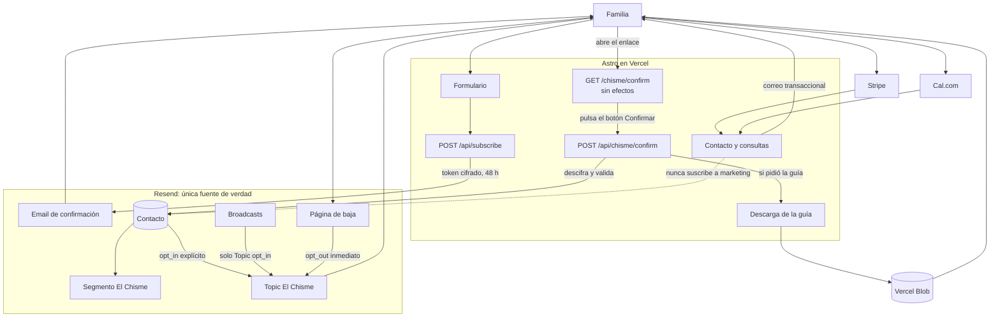

# Doble opt-in de El Chisme

## Decisión

Resend será la única fuente de verdad de suscriptores y bajas. Supabase no se usará para marketing por ahora.

El formulario enviará un enlace de confirmación con un token cifrado y válido durante 48 horas. Solo al pulsarlo se creará o reactivará el Contacto, se añadirá al Segmento y se activará el Topic.

Así no mantenemos dos listas, no necesitamos webhooks de sincronización y no almacenamos solicitudes fallidas.

## Diagrama

## Token de confirmación

El token contendrá cifrados:

- Email normalizado.
- Nombre.
- Origen: newsletter o guía.
- Versión del consentimiento.
- Fecha de caducidad.

Se cifrará con AES-256-GCM usando la librería estándar de Node y `NEWSLETTER_CONFIRMATION_SECRET`. No se añadirá ninguna dependencia.

El token es opaco, no contiene datos legibles y no se guarda en ninguna base de datos.

## Evitar reactivaciones accidentales

El enlace del email abre una página sin efectos. La confirmación solo se procesa al pulsar su botón, evitando que un escáner automático de enlaces suscriba a alguien.

`consented_at`, que ya existe en Resend, identifica la confirmación procesada:

1. Si la fecha cifrada es nueva, se confirma o reactiva el Topic y se guarda la hora a la que se procesa la confirmación.
2. En contactos existentes, se reparan primero el Segmento y el Topic; la reactivación global y `consented_at` se guardan juntas al final. Si Resend falla antes, un reintento puede terminar la operación. El timestamp reduce conflictos entre solicitudes solapadas, pero no actúa como un bloqueo distribuido.
3. Si el mismo enlace se pulsa otra vez, se permite volver a descargar la guía pero no se cambia la preferencia.
4. Si la persona se da de baja y pulsa un enlace antiguo, no se reactiva.
5. Para volver a suscribirse debe rellenar de nuevo el formulario y confirmar un enlace nuevo.

## Qué ocurre con cada caso

| Caso | Resultado |
| --- | --- |
| Email mal escrito o inexistente | No se crea ningún Contacto. El token caduca solo. |
| Email de otra persona | Recibe como máximo la confirmación. Si no pulsa, no entra en marketing. |
| Enlace caducado o manipulado | Se rechaza sin crear ni modificar contactos. |
| Escáner de seguridad abre el enlace | Solo ve la página; no confirma porque no ejecuta el POST del botón. |
| Doble clic | Operación idempotente; no duplica ni reactiva. |
| Ya estaba suscrita y pide la guía | Confirma el buzón, no se duplica y descarga la guía. |
| Estaba dada de baja | Solo se reactiva tras un formulario y una confirmación nuevos. |
| Se da de baja | Resend aplica el opt-out y los Broadcasts dejan de llegar inmediatamente. |
| Rebote o queja | Resend aplica su supresión. La aplicación no la fuerza a volver. |
| Compra, reserva o consulta | Solo recibe los correos necesarios para ese servicio. No entra en El Chisme. |

## Datos y bajas

- Una solicitud sin confirmar no deja datos en nuestra base de datos.
- Resend conserva el estado mínimo necesario para respetar la baja y evitar envíos futuros.
- Supabase, Stripe y Cal.com no se consultan para enviar Broadcasts.
- Darse de baja de El Chisme no borra automáticamente facturas, pagos o consultas: son finalidades distintas y sus plazos deben validarse legalmente.
- Una solicitud de supresión completa se gestionará por proveedor según las obligaciones legales aplicables.

## Cuándo usar Supabase

Solo se añadirá si aparece una necesidad real que Resend y el token cifrado no cubran:

- Asesoría exige un historial inmutable de consentimientos.
- Se necesita una lista de supresión propia tras una solicitud de borrado.
- Hace falta limitar abuso de forma persistente más allá de Vercel Firewall.
- Se necesita conservar de forma fiable una consulta pagada si falla el email.

## Implementación mínima

1. Eliminar los contactos incorrectos y de prueba de Resend.
2. Añadir `NEWSLETTER_CONFIRMATION_SECRET` a Vercel.
3. Cambiar `/api/subscribe` para enviar la confirmación sin crear Contactos.
4. Crear la página GET de confirmación sin efectos y un endpoint POST que active Resend.
5. Cambiar el mensaje del formulario a “Revisa tu correo para confirmar”.
6. Aplicar honeypot y límite por IP en Vercel al envío de confirmaciones.
7. Probar email erróneo, escáner, token caducado, baja, enlace repetido y nueva alta.
